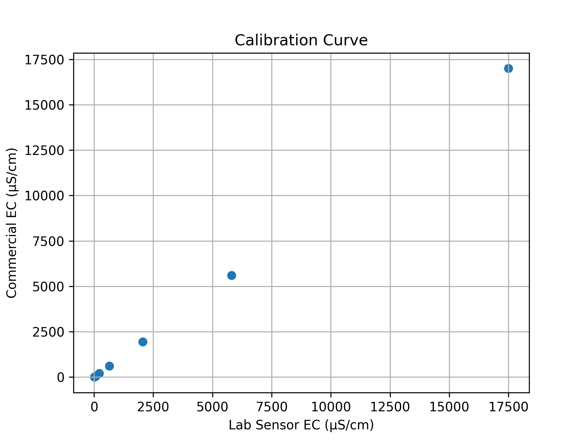
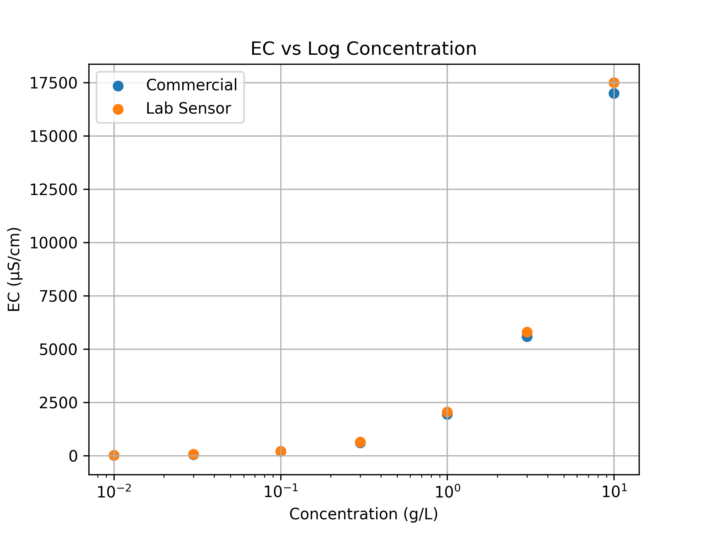
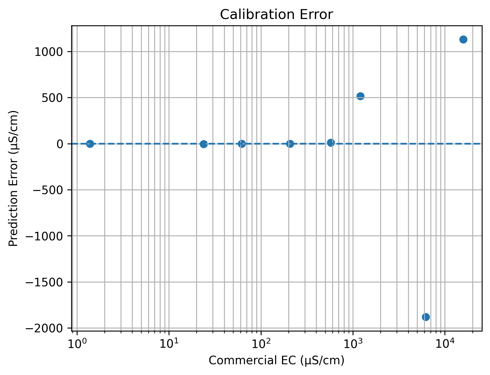

# EC Sensor Calibration Workflow


This project presents a systematic calibration of a lab-developed electrical conductivity (EC) sensor using sodium chloride (NaCl) solutions across a logarithmic concentration range. A commercial EC meter (VWR Symphony SB80PC) is used as the reference instrument to evaluate sensor accuracy, bias, and performance.

---

## Objective

To calibrate a lab-developed EC sensor by mapping its electrical response (I/V ratio) to conductivity (µS/cm) using measurements from a commercial EC meter.

---

## Equipment

- Lab-developed EC sensor  
- VWR Symphony SB80PC commercial conductivity meter  
- Mettler Toledo XS104 analytical balance (±0.0001 g resolution)  
- SCILOGEX MS-H380-Pro magnetic stirrer/hot plate  
- NaCl salt (non-iodized)  
- Deionized (DI) or distilled water  
- 8 sample bottles (500 mL each)  
- Temperature probe  
- Water bath setup (for temperature control)  

---

## Sample Preparation

Each solution is prepared using **500 mL DI water**, with varying NaCl mass to create a logarithmic concentration range.

| Bottle | NaCl Mass (g) | Concentration (g/L) | log10(Conc) | Measured EC (µS/cm) |
|:------:|--------------:|--------------------:|------------:|--------------------:|
| B1     | 0.000         | 0.00                | —           | 1.39 |
| B2     | 0.005         | 0.01                | -2.00       | 23.83 |
| B3     | 0.015         | 0.03                | -1.52       | 61.9 |
| B4     | 0.050         | 0.10                | -1.00       | 206.4 |
| B5     | 0.150         | 0.30                | -0.52       | 575 |
| B6     | 0.500         | 1.00                | 0.00        | 1206 |
| B7     | 1.500         | 3.00                | 0.48        | 6180 |
| B8     | 5.000         | 10.00               | 1.00        | 15840 |

> EC values are **measured using the commercial meter**, not theoretical estimates.

---

## Sensor Output Representation

The lab-developed EC sensor does not directly output conductivity. Instead, it produces:

- Raw signals: `Raw_A0`, `Raw_A1`  
- Adjusted signals: `Adj_A0`, `Adj_A1`  
- Final variable: **`Adj_Ratio` (I/V ratio)**  

This ratio is used as the **independent variable for calibration**.

---

## Calibration Model

Due to the wide dynamic range of EC values, calibration is performed in **log-log space** using a second-order polynomial:

```text
log10(EC) = a(log10(Adj_Ratio))² + b(log10(Adj_Ratio)) + c
EC = 10^[a(log10(Adj_Ratio))² + b(log10(Adj_Ratio)) + c]

This model provides improved accuracy over linear calibration.

Mass Measurement and Transfer Accuracy
NaCl is weighed using a tared weighing boat (or weighing paper)
Transfer loss is minimized by rinsing with DI water
Final solution volume is adjusted to exactly 500 mL

Total uncertainty is maintained within approximately ≤1%

Temperature Control
All samples are maintained at 20°C
A well-mixed water bath is used
Temperature is continuously monitored
Measurements are taken only after equilibrium is reached
Measurement Procedure

For each concentration:

Gently mix solution using a magnetic stirrer
Transfer approximately 50 mL into a clean container
Measure EC using the commercial EC meter (reference)
Record the lab sensor output (Adj_Ratio)
Record temperature
Repeat measurements for 3 trials

Between measurements:

Probes are rinsed thoroughly with DI water
Probes are dried (or gently blotted) to avoid dilution
Measurements are conducted from low → high concentration to minimize contamination
Trials and Data Collection

Each concentration is measured in triplicate (3 trials):

Each trial is recorded as a separate row in the dataset
The trial column identifies repeated measurements
Final calibration uses averaged values for each concentration to reduce noise
Outliers (if present) can be identified and excluded before averaging

Example:

sample_id,...,commercial_ec_uS_cm,adj_ratio,trial
B3,...,61.9,1.18,1
B3,...,63.2,1.20,2
B3,...,60.5,1.17,3
Sensor Range and Limitations

The sensor exhibits reliable behavior within:

~1 → 15,000 µS/cm

Observations:

Strong response for B1–B8
Nonlinear behavior begins near ~30,000 µS/cm
At ~50,000 µS/cm, output becomes unstable
Negative ratios observed due to offset dominance and saturation

Calibration is valid only within the low-to-moderate EC range.
## Results

### Calibration Curve



### EC vs Logarithmic Concentration



### Calibration Error



> The calibration model maps the lab sensor EC output to the commercial meter readings using regression analysis to quantify accuracy, bias, and error.

---

## Repository Structure

```text
ec-sensor-calibration/
│
├── README.md
├── requirements.txt
├── EC_calibration.ipynb  
│
├── data/
│   ├── raw/
│   └── processed/
│
├── scripts/
│   ├── calibrate_ec_sensor.py
│   └── plot_results.py
│
├── results/
│   ├── figures/
│   └── calibration_summary.csv
│
├── docs/
│   └── calibration_protocol.md
│
└── LICENSE
## How to Run

To reproduce the calibration results and plots:

### 1. Install dependencies

```bash
pip install -r requirements.txt
```

### 2. Run calibration

```bash
python scripts/calibrate_ec_sensor.py
```

### 3. Generate plots

```bash
python scripts/plot_results.py
```

---

## Expected Outputs

* `results/calibration_summary.csv`  
* `results/figures/calibration_curve.png`  
* `results/figures/ec_vs_concentration_log.png`  
* `results/figures/error_plot.png`  

---

## Notes

* The commercial EC meter is used as the **reference (ground truth)**  
* NaCl solutions provide controlled variation in ionic concentration  
* Temperature and mixing conditions are controlled for accuracy  
* Low-speed stirring is used to ensure uniformity and minimize air bubbles  
